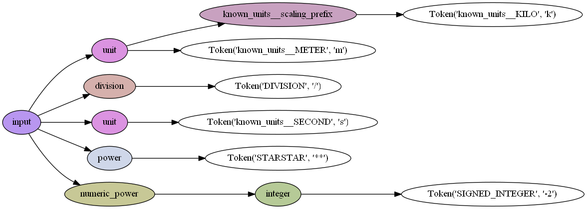

# vounitlex

`vounitlex` is a minimal Python package for lexing and validating VOUnit strings.

## Installation

```bash
git clone https://github.com/jwfraustro/vounitlex.git
cd vounitlex
pip install .
```

## Usage

The current version allows for parsing VOUnit 1.1 strings in two methods: `parse()` and `check()`. The parse method returns the Lark tree, while the check method returns a boolean value indicating whether the string is valid VOUnit syntax.

The parser can recognize known base units, scaling prefixes, and functional operators.

Currently, no additional functionality is provided, but future versions will include methods for interacting with the Lark tree.

Simple examples:

```python
from vounitlex.parser import VOUnitParser

parser = VOUnitParser()

unit_str = "km/s**-2"
parsed = parser.parse(unit_str)
print(parsed.pretty())

"""
  unit
    known_units__scaling_prefix k
    m
  division      /
  unit  s
  power **
  numeric_power
    integer     -2
"""

bad_unit_str = "ft*lb" # Should be "ft.lb" for multiplication
parsed = parser.check(bad_unit_str)
print(parsed) # False
```

A graphical representation of the parsed expression is also available via the `to_png()` method:

```python
parser = VOUnitParser()

unit_str = "km/s**-2"
parsed = parser.parse(unit_str)
parser.to_png(parsed, "unit.png")
```



